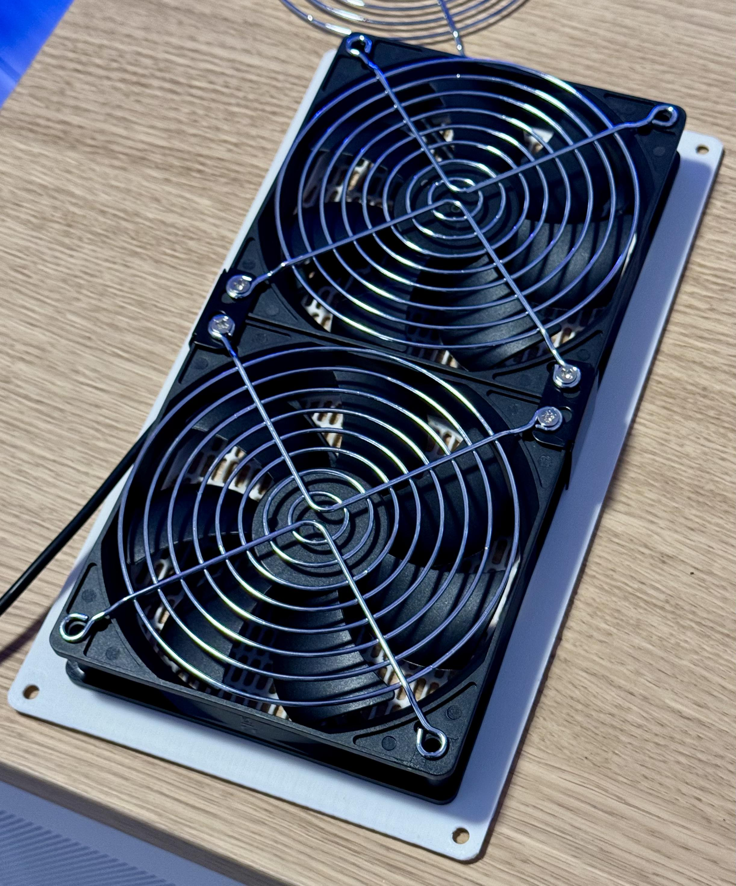
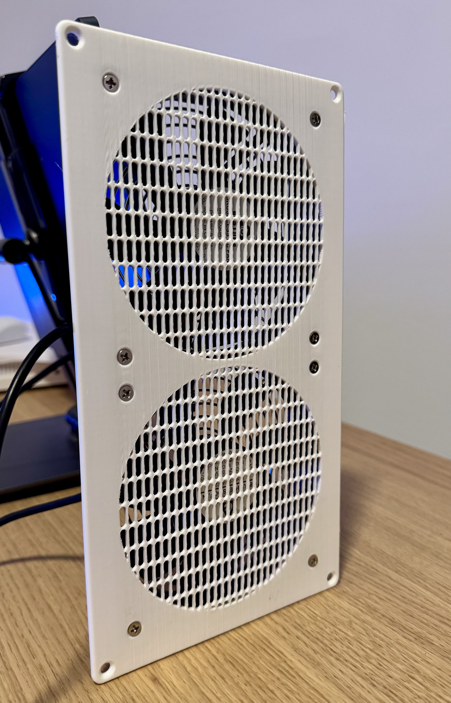
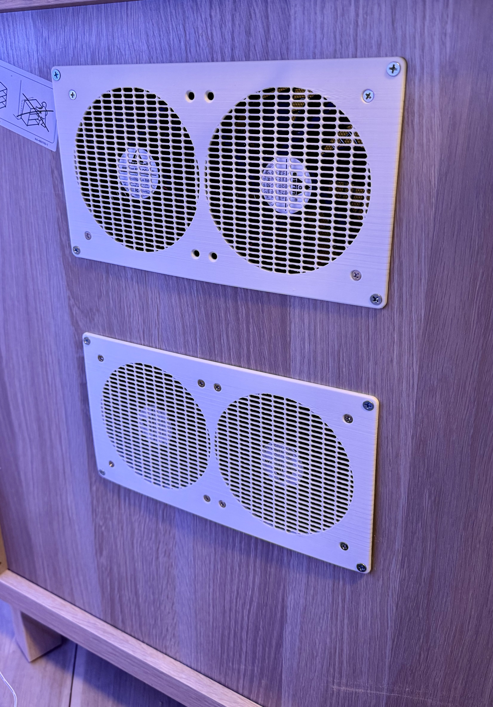

# **Cabinet Fans for Cooling**

Effective cooling is critical for any network cabinet setup, and for my [Network Cabinet](../../README.md), I installed **dual 120mm AC-powered fans** to ensure proper airflow and hardware longevity.

---

## **The Fan Setup**

I used **two sets of dual 120mm AC-powered fans** to provide reliable and quiet cooling. These fans are positioned to optimize airflow through the cabinet, keeping all the rack-mounted equipment running at safe temperatures.

- **Fans:** [Amazon Link](https://amzn.to/3B1EDtV)
- **Shroud STL:** [Fan Shroud Design](https://makerworld.com/en/models/847148#profileId-794416)

The **3D-printed shroud** was designed to streamline airflow and securely mount the fans. It’s a straightforward design that complements the cabinet’s layout while improving cooling efficiency.

---

## **Photos of the Fans in Action**

Here’s how the fans look installed in the cabinet:

[Raw STL file](../../Assets/STLs/fan-intake-plate-120mm.stl)

---

## **Conclusion**

The combination of dual AC-powered fans and a custom 3D-printed shroud offers a durable and efficient cooling solution for the cabinet. If you’re considering a similar setup, check out the links above for the fans and STL file.
