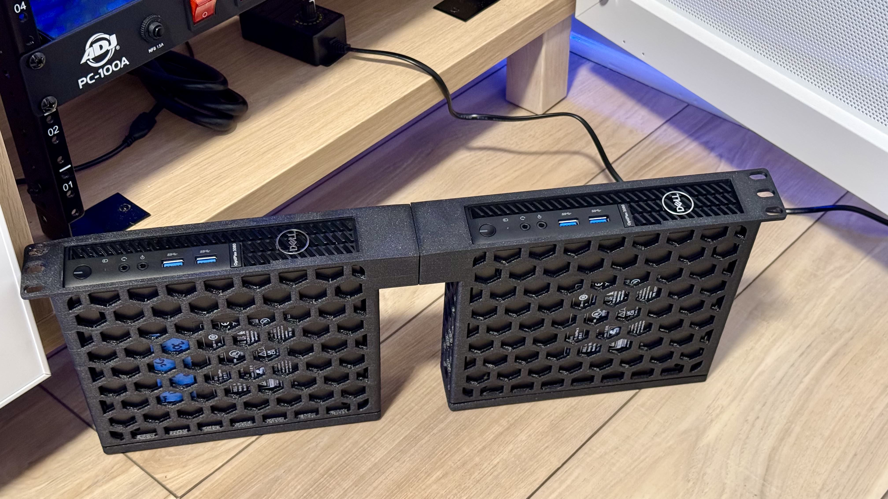
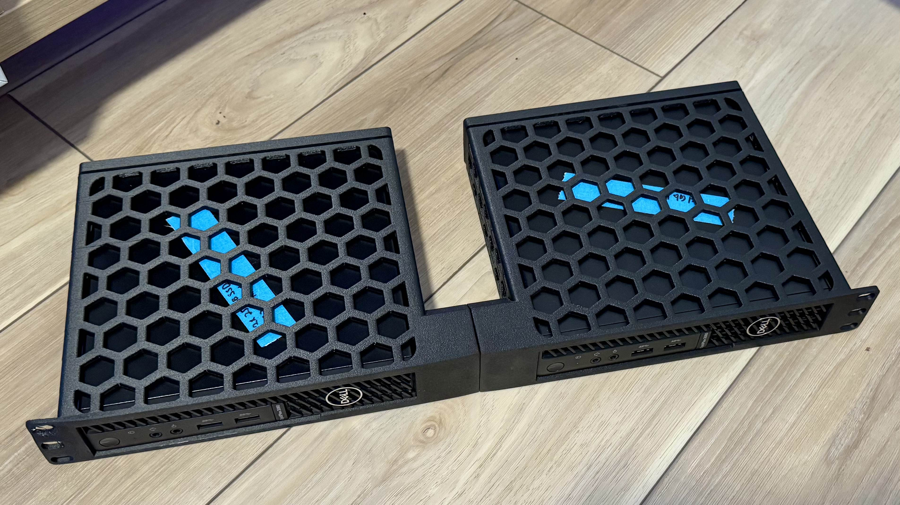
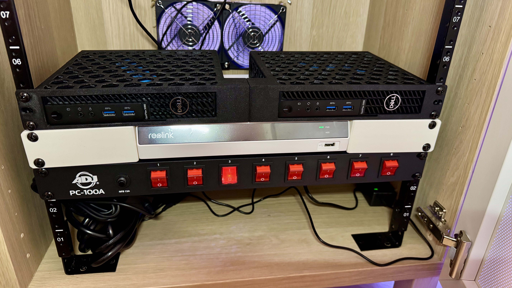

# **Dell 3080 Micros: Dual-Mounted Proxmox Nodes**

As part of my [Network Cabinet](../../README.md) project, I’ve incorporated two Dell 3080 Micros as Proxmox nodes. To maximize space and efficiency, I used a **1U 19-inch rack mount**, specifically designed for dual Dell Micro computers. This custom mount keeps both computers oriented the same way, making the setup clean and functional.

---

## **The Rack Mount Solution**

The rack mount is a **remix design** by [noamf_1251992](https://www.printables.com/@noamf_1251992), built to fit all variations of Dell Micro computers (dimensions: 182mm wide, 178mm deep, 36mm tall). The design is split into multiple parts for flexibility:

- **1 Left and 1 Right** side panel
- **2 Rear panels** (choose between versions with or without zip-tie loops)

Each rear panel attaches with **M4x12mm socket cap screws**, while the left and right sections are joined with **65mm screws** (note: trimming may be needed based on print accuracy). For durability, materials like PETG, ASA, or ABS are recommended, though PLA may suffice in a supported rack setup.

- **STL File:** [Dell Micro 1U Rack Mount](https://www.printables.com/model/644173-dell-micro-1u-rack-mount)

---

## **Materials and Printing Recommendations**

- **Material:** ABS-GF (used for my build)
- **Print Settings:**
  - 0.2mm layer height
  - Front face on the bed for stability and textured finish from the build textured plate

---

## **Photos of the Build**

Here’s how the dual-mounted Dell 3080 Micros look installed in the rack:

---

## **Conclusion**

This dual-mount design is a practical and space-saving way to rack-mount Dell Micro computers. It’s been an excellent solution for adding Proxmox nodes to my setup. If you’re looking for a similar rack-mount for your Dell Micros, check out the STL file linked above. Big thanks to [noamf_1251992](https://www.printables.com/@noamf_1251992) for the original design!
