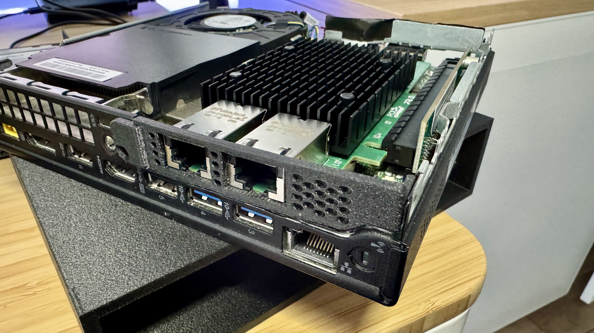

# **Repurposing the Lenovo M920q: Rack-Mounting for My Proxmox Cluster**

When building out my [Network Cabinet](../../README.md), I realized my old Lenovo M920q from a failed OPNsense project could finally be put to good use. With its dual 10GbE ports and compact form factor, it was an ideal candidate to serve as the host for my Proxmox cluster. The 10GbE ports made it perfect for handling high-speed communication with the cluster nodes over a dedicated VLAN.

Here’s how I integrated it into the cabinet.

---

## **Upgrading the M920q with 10GbE**

The Lenovo M920q came equipped with an Intel x540 dual-port 10GbE PCIe card, which I had initially installed during the OPNsense project. While that setup didn’t pan out, the card proved perfect for this new role, providing fast, dedicated VLAN communication between the Proxmox cluster nodes.

The card didn’t fit natively into the M920q’s small form factor, so I used a PCIe riser adapter to make it work. I also found that the NIC’s original brackets weren’t compatible with the M920q’s case, so I tidied things up with a 3D-printed cover. The cover not only protects the card but also makes the build look much cleaner.

- **PCIe Card Cover STL**: [Intel Dual X540 RJ45 Cover for Lenovo M900/M700](https://makerworld.com/en/models/861860#profileId-812288)
- **Intel x540 Dual-Port PCIe Card**: [Amazon Link](https://amzn.to/3BnosHl)

---

## **Rack Mounting for Cabinet Integration**

To integrate the M920q into my network cabinet, I used a 3D-printed 19-inch rack mount specifically designed for small form factor PCs. This rack mount securely holds the M920q and includes four Keystone slots, offering modularity for adding Ethernet jacks, USB ports, or HDMI couplers. It’s a versatile solution that complements the rest of the build.

- **Rack Mount STL**: [Lenovo Tiny 1U Rack Mount Design](https://github.com/JaySea20/Lenovo-Tiny-1U-Rack-Mount)

The rack mount fits seamlessly into the [12U Vertical Server Rack Rail Kit](https://amzn.to/3VlM4mu), making the M920q an efficient and tidy addition to my cabinet setup.

---

### **The Final Setup**

The Lenovo M920q is now securely integrated into my [Network Cabinet](../../README.md), making the most of its compact form factor and powerful networking capabilities. Its dual 10GbE ports are dedicated to a VLAN, providing fast and isolated communication between the Proxmox cluster nodes.

The custom 3D-printed PCIe card cover and rack mount not only keep everything tidy and functional but also ensure the M920q fits seamlessly into the [IKEA BESTÅ cabinet](https://www.ikea.com/us/en/p/besta-frame-white-10245846/), which serves as the foundation for the overall cabinet build.

### **Photos of the Build**

- 
- 
- 

---

### **Conclusion**

Repurposing the Lenovo M920q for this project turned out to be a great way to reuse hardware from a previous setup. Its dual 10GbE ports and small form factor make it a perfect fit for the network cabinet, while the 3D-printed components ensure it stays organized and functional.

If you’re working on a similar project, be sure to check out the STL files and related links I’ve shared—they made this build much easier. Feel free to reach out with questions or to share your own projects!

---

### **Related Posts**

- [Network Cabinet Project Overview](../../README.md)
- [Fan Cooling System for the Cabinet](./Projects/CabinetFans/README.md)
