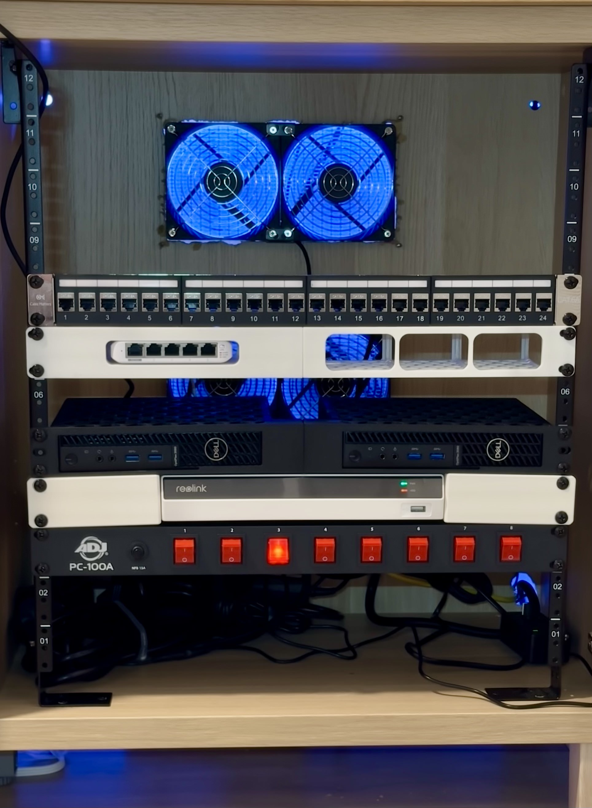

# **Building a Custom Network Cabinet with an IKEA BESTÅ**

Turning an IKEA BESTÅ into a functional 19-inch rack network cabinet is one of those projects that combines practicality and style. This build lets me house my networking gear and small servers in a neat, professional-looking setup, while keeping everything tucked away in a piece of furniture that doesn’t scream “data center.” Here’s how I made it happen.

---

### **Bill of Materials (BOM)**

Here’s what I used to build this custom cabinet:

- **[IKEA BESTÅ](https://www.ikea.com/us/en/p/besta-frame-white-10245846/):**  
  The dual-frame version (120x40x64 cm) is what I chose for this project, but the single-frame option works too if you’re tight on space.
- **[IKEA MÖRTVIKEN Mesh Door](https://www.ikea.com/us/en/p/moertviken-door-white-20490823/):**  
  Provides ventilation while keeping the cabinet’s contents hidden from view.
- **[IKEA BESTÅ Top Panel (Oak)](https://www.ikea.com/us/en/p/besta-top-panel-oak-veneer-20472918/):**  
  Optional, but it gives the cabinet a polished, furniture-grade finish.
- **[12U Vertical Server Rack Rail Kit](https://amzn.to/3VlM4mu):**  
  The backbone of the cabinet, designed to hold standard 19-inch rack-mountable equipment.
- **[Corner Brace Brackets](https://amzn.to/3D0lHwc):**  
  For reinforcing the structure and securing the rack rails.
- **[Power Strip (1800W)](https://amzn.to/4f0fFc4):**  
  To power all the equipment inside the cabinet.
- **[4x 120mm AC-Powered Fans](https://amzn.to/3B1EDtV):**  
  For airflow and keeping everything cool.
- **[Fan Shroud](Projects/CabinetFans/README.md):**  
  A 3D-printed part designed to streamline airflow. STL file available [here](https://makerworld.com/en/models/847148#profileId-794416).

---

### **Design and Build Process**

The idea was simple: transform a piece of IKEA furniture into a fully functional network cabinet that fits seamlessly into a home or office environment. Here’s a breakdown of how I did it:

1. **Assembling the BESTÅ Frame:**  
   The BESTÅ is sturdy enough to handle the weight of network equipment, especially with additional reinforcements. I started by assembling the dual-frame version and ensured it was level.

2. **Installing the Rack Rails:**  
   I mounted the [12U Vertical Server Rack Rails](https://amzn.to/3VlM4mu) inside the frame using [corner brace brackets](https://amzn.to/3D0lHwc) for added stability. These rails allow me to mount standard 19-inch rack equipment securely.

3. **Adding Cooling:** [Project link](Projects/CabinetFans/README.md)  
   To ensure proper airflow, I installed [4x 120mm AC-powered fans](https://amzn.to/3B1EDtV) and used a custom 3D-printed [fan shroud](Projects/CabinetFans/README.md) to channel airflow effectively. This setup keeps the hardware cool while running efficiently.

4. **Power Management:**  
   I included a simple [1800W power strip](https://amzn.to/4f0fFc4) to handle power distribution for all the devices. It’s mounted inside the cabinet for easy access.

5. **Finishing Touches:**
   - The [IKEA MÖRTVIKEN mesh door](https://www.ikea.com/us/en/p/moertviken-door-white-20490823/) provides ventilation while keeping the setup visually minimal.
   - I added the optional [BESTÅ top panel in oak](https://www.ikea.com/us/en/p/besta-top-panel-oak-veneer-20472918/) for a polished finish.

---

### **The Final Setup**

The finished cabinet is clean, compact, and fully functional. It fits perfectly into my workspace and provides a professional solution for housing network equipment. Here’s what it can accommodate:

- Network switch
  - [Unfi Flex mini 2.5G](https://store.ui.com/us/en/category/all-switching/products/usw-flex-2-5g-5)
  - [STL for rack mount](https://www.printables.com/model/1032217-ubiquiti-unifi-usw-flex-mini-25g-5-19-inch-modular)
- Servers or Clusters
  - Lenovo M920q Proxmox host [Project link](./Projects/Lenovo%20M920q/README.md)
  - Dell 3080 Micros (Proxmox nodes) [Project link](./Projects/Dell%203080%20micros/README.md)
- Reolink NVR: RLN8-410-White
  - [STL for rack mount](https://makerworld.com/en/models/862135#profileId-812635)
  - [Amazon Link](https://amzn.to/4g2nuPL)

---

### **[WIP] Photos of the Build**

<!-- - [Photo of the BESTÅ frame during assembly]
- [Photo of rack rails installed]
- [Photo of the completed network cabinet with equipment installed] -->

---

### **Sub-Posts and Resources**

This project includes several components that I’ve detailed in separate posts. Check them out for more in-depth information and STL files:

- [Lenovo M920q Proxmox Node](./Projects/M920q.md)
- [Fan Cooling System](./Projects/CabinetFans/README.md)

---

### **Why This Project?**

I wanted a network cabinet that doesn’t look out of place in a home but still delivers the functionality of a traditional server rack. The BESTÅ cabinet strikes a perfect balance between style and practicality, making it a great foundation for this build.

If you’re considering building a similar setup, feel free to use the links and resources here as a starting point. Let me know if you have any questions or want to share your own IKEA-based rack projects.
